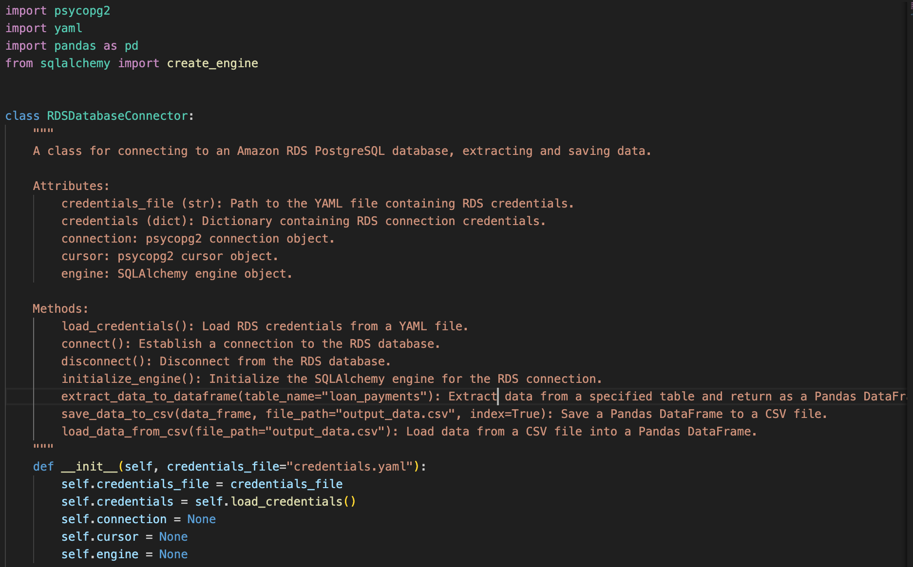
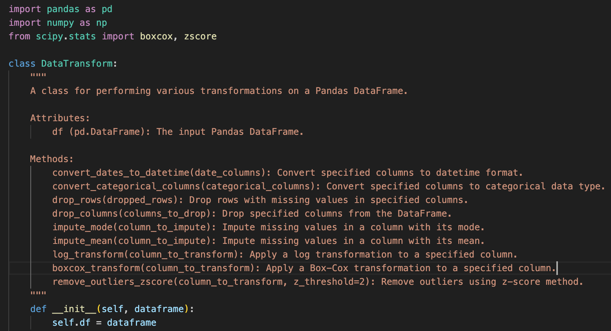
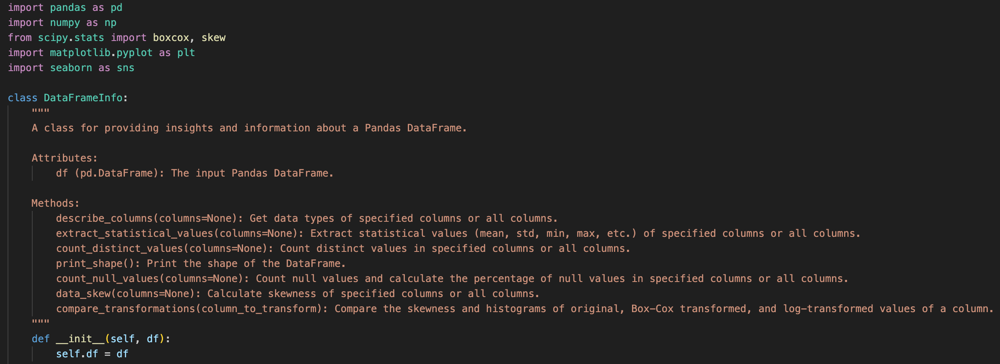
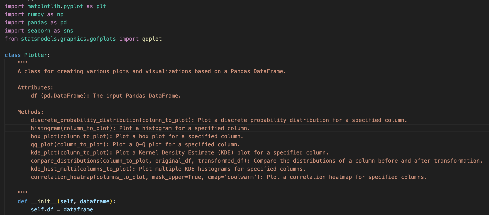
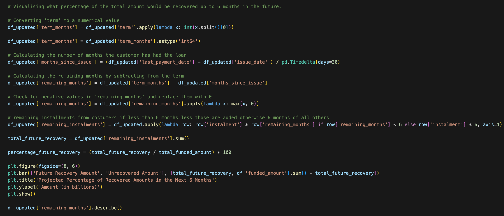
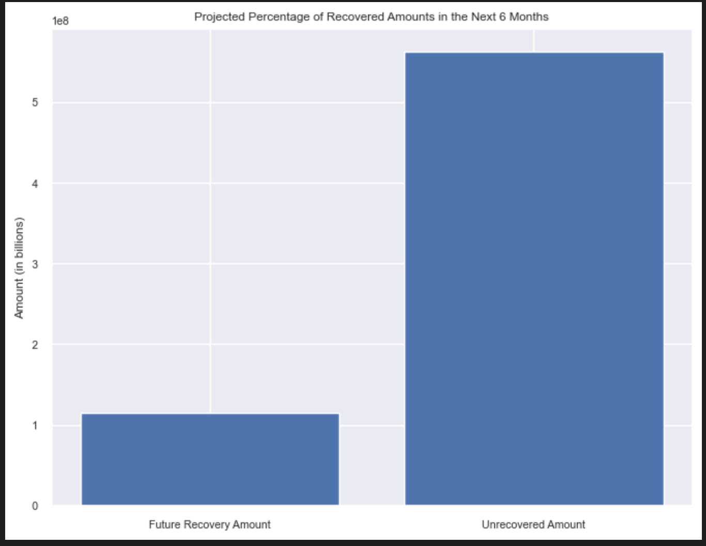
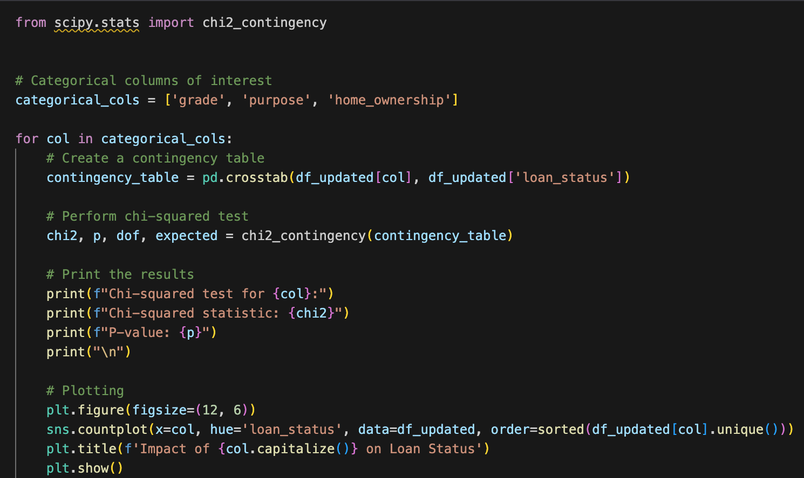
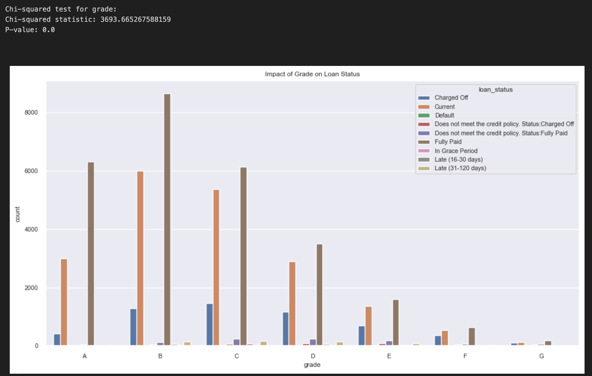

# Exploratory Data Analysis Project using a Customer Loan Database
Performing exploratory data analysis on a loan portfolio, using various statistical and data visualisation techniques to uncover patterns, relationships, and anomalies in the loan data.

## Table of contents
1. [Aim of the Project](#aim-of-the-project)
2. [Project Stages](#project-stages)
    - [Data Extraction](#data-extraction)
    - [Exploratory Data Analysis](#exploratory-data-analysis)
    - [Analysis and Visualization](#analysis-and-visualization)
3. [File Structure](#file-structure)
4. [CSV Files](#csv-files)

## Aim of the project
To analyse a robust database of loan customers by first making a number of classes to make this task easier, followed by transforming the data to eliminate outliers, null values, skewness, and making sure the data is ready for analysis. Finally, analysis takes place to observe different trends through graphs and calculations. A few examples of this: visualising the state of the loans and projected profits, seeing losses due to charged-off loans and exploring potential predictors that may indicate losses. 

## Project stages
- Outline of the project, for further detail please refer to main.ipynb and each respective class. 

#### Data Extraction
- The db_utils.py file is created in order to create the RDSDatabaseConnector class which contains method to extract the data from an RDS Database
- A credentials.yaml file to store the database credentials was created and subsequently added to the .gitignore file.
- RDSDatabaseConnector class snippet:
    - 

### Exploratory Data Analysis
- A DataTransform class was created for the purpose of transformation made to the data.
- A DataFrameInfo class was created for the purpose of querying the data to observe patterns to either transform or draw conclusions for further analysis
- A Plotter class was creater for the purpose of observing patterns, differences whilst querying the data and of course for visualising insights during analysis
- DataTransform class snippet:
    - 
- DataFrameInfo class snippet: 
    - 
- Plotter class snippet: 
    -  
- On the main jupyter notebook:
    - Missing values and were removed or imputed accordingly
    - Skewed columns were transformed 
    - Outliers were removed 
    - Overtly correlated columns were removed
    - Each of these steps is accompanied by various visualisation and querying methods to make the best decision, please refer to main.ipynb

### Analysis and Visualisation
- Current State of the loans
    - Summarising and visualising currently what percentage of the loans are recovered against the investor funding and the total amount funded. Visualise your results on an appropriate graph.
    - Visualising what percentage of the total amount would be recovered up to 6 months' in the future.
        - 
        - 
- Calculated Loss
    - Calculating what percentage of loans have been lost to the company (the loans marked as 'Charged Off' on loan_status)
    - Calculating the percentage of charged off loans historically and the total amount that was paid towards these loans before being charged off
- Projected Loss
    - Calculating the projected loss of the loans marked as Charged Off.
    - Calculating and visualising the loss in revenue these loans would have generated for the company if they had finished their term.
- Possible Loss
    - Calculating the projected loss of the loans marked as Charged Off.
    - Calculating the loss in revenue these loans would have generated for the company if they had finished their term. 
    - Visualising the loss projected over the remaining term of these loans.
- Indicators of loss
    - Visualising the possible indicators that a customer will not be able to pay the loan
        - 
        - 

## File Structure
- images
    - chi_p_vis.png
    - chi_p.png
    - DataFrameInfo.png
    - DataTransform.png
    - Plotter.png
    - RDSDatabaseConnector.png
    - total_recovered_6_vis.png
    - total_recovered_6.png
- .gitignore
- credentials.yaml
- data_frame_info.py - class DataFrameInfo
- data_transform_class.py - class DataTransform
- db_utils.py - class RDSDatabaseConnector
- loan_payments_whole.csv
- main.ipynb
- plotter_class.py - class Plotter
- README.md
- updated_2_loan_payments.csv
- updated_3_loan_payments.csv
- updated_4_loan_payments.csv
- updated_loan_payments.csv

## CSV Files
- loan_payments_whole.csv - initial file downloaded using the credentials and RDSConnector. It is a loan customer database. You can use the DataFrameInfo class for more details on this file. 
- updated_loan_payments.csv - first update containing changes such as: eliminations of nulls through imputation and carefully selecting columns and rows to drop. Details on the notebook file. This is the file used for milestone 4 analysis. 
- updated_2_loan_payments.csv - update where the skew is corrected
- updated_3_loan_payments.csv - update where the outliers are eliminated 
- updated_4_loans_payments.csv - update where highly correlated columns are dropped